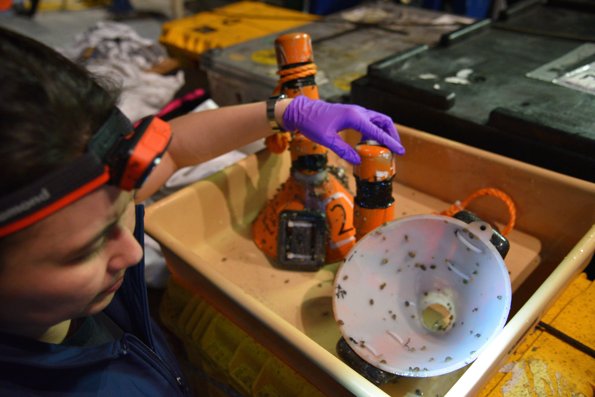

```{r setup, include=FALSE}
knitr::opts_chunk$set(echo = TRUE)
```

```{r Library loading initial, message=FALSE}
library(tidyverse); library(cowplot)
library(phyloseq); library(decontam)
library(plotly); library(lubridate)
```

# Merged data from QIIME2 analysis

Run below to repeat ASV compilation from raw QIIME2 output.
```{r Join raw taxonomy and ASV data}
# merged_tax <- read_delim("/Users/sarahhu/Desktop/Projects/microeuks_deepbiosphere_datamine/microeuk-amplicon-survey/data-input/taxonomy.tsv", delim = "\t")
# merged_asv <- read_delim("/Users/sarahhu/Desktop/Projects/microeuks_deepbiosphere_datamine/microeuk-amplicon-survey/data-input/microeuk-merged-asv-table.tsv", delim = "\t", skip = 1)
# metadata <- read.delim("/Users/sarahhu/Desktop/Projects/microeuks_deepbiosphere_datamine/microeuk-amplicon-survey/data-input/samplelist-metadata.txt")
# 
# asv_wtax <- merged_asv %>%
#   select(FeatureID = '#OTU ID', everything()) %>%
#   pivot_longer(cols = !FeatureID,
#                names_to = "SAMPLE", values_to = "value") %>%
#   left_join(merged_tax, by = c("FeatureID" = "Feature ID")) %>%
#   left_join(metadata) %>%
#   filter(SITE == "GordaRidge" | SITE == "substrate" | SITE == "Laboratory") %>%
#   filter(!grepl("Siders_", SAMPLE)) %>%
#   filter(!(grepl("T0", SAMPLE))) %>%
#   filter(!(grepl("T24", SAMPLE))) %>%
#   filter(!(grepl("T36", SAMPLE))) %>%
#   mutate(DATASET = case_when(
#     grepl("_GR_", SAMPLE) ~ "GR",
#     grepl("Gorda", SAMPLE) ~ "GR",
#     grepl("_MCR_", SAMPLE) ~ "MCR",
#     grepl("Axial", SAMPLE) ~ "Axial",
#   TRUE ~ "Control or blank")) %>%
#     separate(Taxon, c("Domain", "Supergroup",
#                   "Phylum", "Class", "Order",
#                   "Family", "Genus", "Species"), sep = ";", remove = FALSE)
# 
# # fix naming, some controls sequenced separately.
# gr_substrate_fluid_asvs <- asv_wtax %>%
#   mutate(SAMPLE_tmp = case_when(
#     Sample_actual == "" ~ SAMPLE,
#     TRUE ~ Sample_actual
#   )) %>%
#   select(-SAMPLE) %>%
#   select(SAMPLE = SAMPLE_tmp, everything()) %>%
#   filter(value > 0)

# View(gr_substrate_fluid_asvs)
# View(gr_substrate_fluid_asvs %>% filter(Sample_or_Control == "Control") %>% select(SAMPLE) %>% distinct())
# save(gr_substrate_fluid_asvs, file = "/Users/sarahhu/Desktop/Projects/GordaRidge-microcolonizers/microcolonizers-GordaRidge/input-data/asv-table.RData")
```

# Background information

Microcolonizers (or 'cones') were deployed at the Gorda Ridge hydrothermal vent field. Each microcolonizer was placed over a region of visible diffuse fluid flow. A total of 6 microcolonizers were depeloyed at one time, pairs of experiments were picked up after 6, 7, and 8 days.


Each microcolonizer chamber had 6 different substrates, so that diffuse fluid could reach each substrate. Temperature loggers also recorded temperature for the duration of the deployments. Substrates included: shell, riftia shell, quartz, pyrite, basalt, and olivine.

```{r out.width ="40%", echo=FALSE, fig.cap="Microcolonizers at Mt. Edwards vent site. Credit: Ocean Exploration Trust"}
knitr::include_graphics("images/mtedwards.png")
```


```{r out.width ="40%", echo=FALSE, fig.cap="Recovering microcolonizers with ROV Hercules. Credit: Ocean Exploration Trust"}

```

Upon recovery of each experiment, substrates were saved for microscopy and molecular analysis. For the sequence data below (shell, quartz, and riftia), RNA was extracted, cDNA was created and the V4 18S rRNA hypervariable region was amplified and sequenced. Blank substrates (which sat with milliQ during the shipboard processing)  were also sequenced alongside the experimental treatments.

```{r out.width ="40%", echo=FALSE, fig.cap="Opening up microcolonizers after recovery. Credit: Mirmalek"}

```

## Core questions (related to protists)

* How does the microcolonizer community compare to the background, plume, and diffuse fluid community? How does it compare to the resident or cosmpolitan community?
* If shared, do we know if these species have specific traits that would enable them to settle? Are there any other unifying traits for species detected at the substrate vs. diffuse fluid?
* How does the community composition change over deployment length? 6, 7, vs. 8 days? Does temperature play a role in this?
* What species are detected across substrate types? vs. only found at 1 type of substrate?
* For specific taxa like ciliates and metazoa, that make up a large proportion of the substrate community, how does species richness and evenness compare across substrate vs. vent fluid?
* Are differences in community composition & diversity at the substrates similar with the 18S vs. 16S data?
* What are the most commonly occurring pairs of 16S and 18S amplicons?


_Approach_
* Explore above questions with molecular data, include a combined approach with 16S and 18S. Start with 18S rRNA gene tag-sequence data first.
* Pinpoint a few samples to explore for microscopy?
* A very cool goal would be to do the network analyses and characterization of community composition and then capture the same or related organisms microscopically.
* Explore bodonids and related taxa, especially paying attention to parasites.
* Also look for saprophytes (fungi)
* Examine pictures closer and look for presence of potential parasites to the limpets, else?

_Hypotheses_

* In a previous microcolonizer experiment where organic, iron-rich, vs. mineral substrates were placed at a hydrothermal vent site, the molecular analysis did not show a significant difference in the community composition across substrates (Lopez-Garcia et al.). They found that within only 2 weeks, microaerophilic bodonids and ciliatese pioneereed the colonization process.
* Diversity of protists included: bodonids (Kinetoplastida), alveolatees (specifically ciliates, Perkinsozoa, Group I), metazoa, fungi, and radiolaria. Many divergent eukaryotic lineages.
* In the previous study, a similar composition of taxa were found in the surrounding vent fluid and settled on the substrate. But there wree different metazoa (mainly polychaetes)


# Import microcolonizer data

```{r}
load("input-data/asv-table.RData", verbose = TRUE)
```

### Quick look - unprocessed data
Barplots to show total number of sequences and total number of ASVs
```{r Plot total ASV and sequences, fig.height=12, fig.width=19}
plot_grid(gr_substrate_fluid_asvs %>% 
  filter(value > 0) %>% 
  ggplot(aes(x = SAMPLE)) +
  geom_bar(stat = "count", width = 0.9) +
  labs(y = "Total ASVs") +
  coord_flip() +
  theme_linedraw() +
  facet_grid(DATASET ~ ., scale = "free", space = "free") +
  theme(axis.text.x = element_text(angle = 90, hjust = 1, vjust = 1),
        strip.background = element_blank(), strip.text = element_text(color = "black")),
  gr_substrate_fluid_asvs %>% 
  group_by(SAMPLE, SITE, Domain, DATASET) %>% 
  summarise(SUM_SEQ_DOMAIN = sum(value)) %>% 
  ggplot(aes(x = SAMPLE, y = SUM_SEQ_DOMAIN, fill = Domain)) +
  geom_bar(stat = "identity", color = "black", width = 0.9) +
  labs(y = "Total Sequences") +
  coord_flip() +
  theme_linedraw() +
  facet_grid(DATASET ~ ., scale = "free", space = "free") +
  theme(axis.text.x = element_text(angle = 90, hjust = 1, vjust = 1),
        strip.background = element_blank(), strip.text = element_text(color = "black"),
        legend.position = "bottom"),
  ncol = 2)
```

### Table reporting total ASVs and sequences
```{r Total ASVs raw}
# View(gr_substrate_fluid_asvs %>% filter(value > 0) %>% 
#        group_by(SAMPLE, DATASET, SITE) %>% 
#        summarise(SEQ_SUM = sum(value),
#                  ASV_COUNT = n()))
```


## Decontaminate sequence library
Import sample description text file, import as phyloseq library, and remove potential contaminate ASVs and sequences. Catalog total number of ASVs and sequences removed from analysis.

### Import as phyloseq objects
```{r Extract taxa and sample info as matrix for phyloseq input}
# head(gr_substrate_fluid_asvs)
tax_matrix <- gr_substrate_fluid_asvs %>% 
  select(FeatureID, Taxon) %>% 
  distinct() %>% 
  separate(Taxon, c("Domain", "Supergroup", 
                  "Phylum", "Class", "Order",
                  "Family", "Genus", "Species"), sep = ";", remove = FALSE) %>% 
  column_to_rownames(var = "FeatureID") %>% 
  as.matrix

asv_matrix <- gr_substrate_fluid_asvs %>% 
  select(FeatureID, SAMPLE, value) %>% 
  pivot_wider(names_from = "SAMPLE", values_fill = 0, values_from = value) %>% 
  column_to_rownames(var = "FeatureID") %>% 
  as.matrix

# Align row names for each matrix
rownames(tax_matrix) <- row.names(asv_matrix)

metadata_cones <- gr_substrate_fluid_asvs %>% 
  select(SAMPLE, Type, VENT, SITE, SAMPLETYPE, Sample_or_Control) %>% 
  distinct() %>% 
  column_to_rownames(var = "SAMPLE")
```

```{r Phyloseq import}
# Import asv and tax matrices
ASV = otu_table(asv_matrix, taxa_are_rows = TRUE)
TAX = tax_table(tax_matrix)
phylo_obj <- phyloseq(ASV, TAX)

# Import metadata as sample data in phyloseq
samplenames <- sample_data(metadata_cones)

# join as phyloseq object
physeq_wnames = merge_phyloseq(phylo_obj, samplenames)
# colnames(ASV)

## Check
# physeq_wnames
# View(gr_substrate_fluid_asvs %>% filter(value > 0))
```

### Identify contaminant ASVs

In addition to shipboard milliQ blank samples, each substrate type had a 'blank' control, which was sampled at the same time, but never deployed in the microcolonizers (only processed at the same time in the lab). 

```{r Assign control samples}
# When "Control" appears in "Sample_or_Control column, this is a negative control"
sample_data(physeq_wnames)$is.neg <- sample_data(physeq_wnames)$Sample_or_Control == "Control"
```

```{r Identify contaminant ASVs}
# ID contaminants using Prevalence information
contam_prev <- isContaminant(physeq_wnames, 
                               method="prevalence", 
                               neg="is.neg", 
                               threshold = 0.5, normalize = TRUE) 

# Report number of ASVs IDed as contamintants
table(contam_prev$contaminant)
```
> 0.5 - this threshold will ID contaminants in all samples that are more prevalent in negative controls than in positive samples.

### Remove problematic ASVs
```{r Assign contaminant ASVs}
# Subset contaminant ASVs
contams <- filter(contam_prev, contaminant == "TRUE")
list_of_contam_asvs <- as.character(row.names(contams))
# length(list_of_contam_asvs)

taxa_contam <- as.data.frame(tax_matrix) %>% 
  rownames_to_column(var = "FeatureID") %>% 
  filter(FeatureID %in% list_of_contam_asvs)
# head(taxa_contam)
```


```{r Compare decontaminated data with original}
# View(asv_wtax)
asv_wtax_decon <- gr_substrate_fluid_asvs %>% 
  filter(!(FeatureID %in% list_of_contam_asvs)) %>% 
  filter(!(Sample_or_Control == "Control"))

tmp_orig <- (gr_substrate_fluid_asvs %>% filter(!(Sample_or_Control == "Control")))

# Stats on lost
x <- length(unique(tmp_orig$FeatureID)); x
y <- length(unique(asv_wtax_decon$FeatureID)); y
100*((y-x)/x) #0.43% of ASVs lost
a <- sum(tmp_orig$value);a #3.1 million
b <- sum(asv_wtax_decon$value);b #2.89 million 
100*((b-a)/a)
# Lost 5.5% of sequences from whole dataset.

## Subsample to clean ASVs
asv_wtax_wstats <- gr_substrate_fluid_asvs %>% 
  mutate(DECONTAM = case_when(
    FeatureID %in% list_of_contam_asvs ~ "FAIL",
    TRUE ~ "PASS"
  ))
```

```{r, fig.height=12, fig.width=10}
plot_grid(asv_wtax_wstats %>% 
  filter(value > 0) %>% 
  ggplot(aes(x = SAMPLE, fill = DECONTAM)) +
  geom_bar(stat = "count", width = 0.9, color = "black") +
  labs(y = "Total ASVs") +
  coord_flip() +
  theme_linedraw() +
  facet_grid(DATASET ~ ., scale = "free", space = "free") +
  theme(axis.text.x = element_text(angle = 90, hjust = 1, vjust = 1),
        strip.background = element_blank(), strip.text = element_text(color = "black"),
        legend.position = "bottom"),
  asv_wtax_wstats %>% 
  group_by(SAMPLE, SITE, DECONTAM, DATASET) %>% 
  summarise(SUM_SEQ_DOMAIN = sum(value)) %>% 
  ggplot(aes(x = SAMPLE, y = SUM_SEQ_DOMAIN, fill = DECONTAM)) +
  geom_bar(stat = "identity", color = "black", width = 0.9) +
  labs(y = "Total Sequences") +
  coord_flip() +
  theme_linedraw() +
  facet_grid(DATASET ~ ., scale = "free", space = "free") +
  theme(axis.text.x = element_text(angle = 90, hjust = 1, vjust = 1),
        strip.background = element_blank(), strip.text = element_text(color = "black"),
        legend.position = "bottom"),
  ncol = 2)
```


# Subset Gorda Ridge Cones and _in situ_

Isolate Gorda Ridge substrate samples and the in situ samples from Mt Edwards, plume at Mt Edwards and the background seawater. Remove in situ
```{r Isolate in situ only}
# colnames(asv_wtax_wstats)
# unique(asv_wtax_wstats$Sample_actual)
# Isolate blank substrate for GR cones

asv_GR <- asv_wtax_wstats %>% 
      filter(Sample_or_Control != "Control") %>% # rm controls
      filter(SITE == "substrate" | VENT == "Mt Edwards" | 
                VENT == "Mt Edwards Plume" | VENT == "Deep seawater" | VENT == "Shallow seawater") %>% 
      filter(DATASET != "Axial", DATASET != "MCR") %>% 
      filter(!grepl("_expTf_", SAMPLE)) %>% 
      filter(value > 0) %>% 
      filter(DECONTAM == "PASS") #%>% 
      # bind_rows(asv_substrate_blanks)

# Get quick stats on totals
sum(asv_GR$value) # 2.3 million sequences
length(unique(asv_GR$FeatureID)) #3370 ASVs

# View(asv_GR)
# unique(asv_GR$VENT)
```

## Start here for analyses.
```{r}
# save(asv_GR, file = "input-data/asv-table-processed.RData")
# load("input-data/asv-table-processed.RData", verbose = TRUE)
```


Additional sample QC, check replicates, and determine if replicates should be averaged.
```{r Investigate sequence and sample QC, fig.height=9, fig.width=14}
plot_grid(asv_GR %>% 
  group_by(SAMPLE, VENT, DATASET, SAMPLETYPE, Domain) %>% 
  summarise(seqsum_var = sum(value),
            asvcount_var = n()) %>% 
  pivot_longer(ends_with("_var"), names_to = "VARIABLE") %>% 
  ggplot(aes(x = SAMPLE, y = value, fill = Domain)) +
    geom_bar(color = "black", stat = "identity", position = "fill") +
    facet_grid(VARIABLE ~ SAMPLETYPE, space = "free", scales = "free") +
  scale_y_continuous(expand = c(0,0)) +
  theme_linedraw() +
  scale_fill_brewer(palette = "Paired") +
  theme(strip.background = element_blank(), strip.text = element_text(color = "black"),
        axis.text.x = element_text(color = "black", angle = 90, hjust = 1, vjust = 0.5),
        legend.position = "bottom"),
  asv_GR %>% 
  group_by(SAMPLE, VENT, DATASET, SAMPLETYPE, Domain) %>% 
  summarise(seqsum_var = sum(value),
            asvcount_var = n()) %>% 
  pivot_longer(ends_with("_var"), names_to = "VARIABLE") %>% 
  ggplot(aes(x = SAMPLE, y = value, fill = Domain)) +
    geom_bar(color = "black", stat = "identity", position = "stack") +
    facet_grid(VARIABLE ~ SAMPLETYPE, space = "free_x", scales = "free") +
  scale_y_continuous(expand = c(0,0)) +
  theme_linedraw() +
  scale_fill_brewer(palette = "Paired") +
  theme(strip.background = element_blank(), strip.text = element_text(color = "black"),
        axis.text.x = element_text(color = "black", angle = 90, hjust = 1, vjust = 0.5),
        legend.position = "bottom"),
ncol = 2)
```

Based on above plot, remove "BSW020" sterivex filter. 

## Taxonomy bar plots

Supergroup distribution by background fluid vs. what was isolated from substrates.

Factor supergroup names
```{r}
tmp <- asv_GR %>% 
  filter(Domain == "Eukaryota") %>%
  filter(Sample_or_Control != "Control") %>% 
  # unite(SampleIdentifier, VENT, SAMPLETYPE, sep = " ", remove = FALSE) %>% 
  mutate(Supergroup = ifelse(is.na(Supergroup), "Unknown Eukaryota", Supergroup),
         Phylum = ifelse(is.na(Phylum), "Unknown", Phylum),
         Phylum = ifelse(Phylum == "Alveolata_X", "Ellobiopsidae", Phylum),
         Supergroup = ifelse(Supergroup == "Alveolata", paste(Supergroup, Phylum, sep = "-"), Supergroup))
colors_tax <- c("#f1eef6", "#d7b5d8", "#df65b0", "#ce1256", "#fc9272", "#ef3b2c", 
    "#800026", "#fff7bc", "#fec44f", "#d95f0e", "#a63603", "#74c476", "#238b45", 
    "#00441b", "#7fcdbb", "#084081", "#c6dbef", "#2b8cbe", "#016c59", "#bcbddc", 
    "#807dba", "#54278f", "#bdbdbd", "black")

tax_names <- as.character(unique(tmp$Supergroup))
names(colors_tax) <- tax_names
```


```{r make bar plot back, fig.width=12, fig.height=8}
# View(asv_GR)
by_supergroup_back <- asv_GR %>% 
  filter(Domain == "Eukaryota") %>%
  filter(Sample_or_Control != "Control") %>% 
  # unite(SampleIdentifier, VENT, SAMPLETYPE, sep = " ", remove = FALSE) %>% 
  mutate(Supergroup = ifelse(is.na(Supergroup), "Unknown Eukaryota", Supergroup),
         Phylum = ifelse(is.na(Phylum), "Unknown", Phylum),
         Phylum = ifelse(Phylum == "Alveolata_X", "Ellobiopsidae", Phylum),
         Supergroup = ifelse(Supergroup == "Alveolata", paste(Supergroup, Phylum, sep = "-"), Supergroup)) %>% 
  group_by(FeatureID, Taxon, Domain, Supergroup, Phylum, Class, Order, Family, Genus, Species,
           VENT, SITE, SAMPLETYPE, YEAR, DATASET, Type) %>% 
    summarise(SEQ_AVG_REP = mean(value)) %>% 
  ungroup() %>% 
  group_by(SITE, SAMPLETYPE, VENT, Supergroup, Type) %>% 
    summarise(SEQ_SUM = sum(SEQ_AVG_REP)) %>% 
  unite(Sample_substrate, VENT, Type, sep = " ") %>% 
  filter(SITE == "GordaRidge") %>% 
  ggplot(aes(x = Sample_substrate, y = SEQ_SUM, fill = Supergroup)) +
    geom_bar(stat = "identity", position = "fill", color = "black", width = 0.6) +
    facet_grid(. ~ SITE + SAMPLETYPE, space = "free_x", scales = "free") +
  theme_linedraw() +
  theme(axis.text.x = element_text(angle = 90, hjust = 1, vjust = 1),
        strip.background = element_blank(), strip.text = element_text(color = "black")) +
  scale_y_continuous(expand = c(0,0)) +
  scale_fill_manual(values = colors_tax) +
  labs(title = "Microcolonizers and background", x = "", y = "Relative sequence abundance")

by_supergroup_substrate <- asv_GR %>% 
  filter(Domain == "Eukaryota") %>%
  filter(Sample_or_Control != "Control") %>% 
  # unite(SampleIdentifier, VENT, SAMPLETYPE, sep = " ", remove = FALSE) %>% 
  mutate(Supergroup = ifelse(is.na(Supergroup), "Unknown Eukaryota", Supergroup),
         Phylum = ifelse(is.na(Phylum), "Unknown", Phylum),
         Phylum = ifelse(Phylum == "Alveolata_X", "Ellobiopsidae", Phylum),
         Supergroup = ifelse(Supergroup == "Alveolata", paste(Supergroup, Phylum, sep = "-"), Supergroup)) %>% 
  group_by(FeatureID, Taxon, Domain, Supergroup, Phylum, Class, Order, Family, Genus, Species,
           VENT, SITE, SAMPLETYPE, YEAR, DATASET, Type) %>% 
    summarise(SEQ_AVG_REP = mean(value)) %>% 
  ungroup() %>% 
  group_by(SITE, SAMPLETYPE, VENT, Supergroup, Type) %>% 
    summarise(SEQ_SUM = sum(SEQ_AVG_REP)) %>% 
  unite(Sample_substrate, VENT, Type, sep = " ") %>% 
  filter(SITE != "GordaRidge") %>% 
  ggplot(aes(x = Sample_substrate, y = SEQ_SUM, fill = Supergroup)) +
    geom_bar(stat = "identity", position = "fill", color = "black", width = 0.6) +
    facet_grid(. ~ SITE + SAMPLETYPE, space = "free_x", scales = "free") +
  theme_linedraw() +
  theme(axis.text.x = element_text(angle = 90, hjust = 1, vjust = 1),
        strip.background = element_blank(), strip.text = element_text(color = "black")) +
  scale_y_continuous(expand = c(0,0)) +
  scale_fill_manual(values = colors_tax) +
  labs(title = "Microcolonizers and background", x = "", y = "Relative sequence abundance")


```

### Taxonomy plot of background fluid
```{r}
plotly::ggplotly(by_supergroup_back)
```
### Taxonomy plot of microcolonizers

```{r}
plotly::ggplotly(by_supergroup_substrate)
```

### Plot only metazoa
```{r plot metazoa only, fig.width=12, fig.height=8}
metazoa_substrate <- asv_GR %>% 
  filter(Domain == "Eukaryota") %>%
  filter(Sample_or_Control != "Control") %>% 
  mutate(Supergroup = ifelse(is.na(Supergroup), "Unknown Eukaryota", Supergroup),
         Phylum = ifelse(is.na(Phylum), "Unknown", Phylum),
         Phylum = ifelse(Phylum == "Alveolata_X", "Ellobiopsidae", Phylum),
         Supergroup = ifelse(Supergroup == "Alveolata", paste(Supergroup, Phylum, sep = "-"), Supergroup)) %>% 
  group_by(FeatureID, Taxon, Domain, Supergroup, Phylum, Class, Order, Family, Genus, Species,
           VENT, SITE, SAMPLETYPE, YEAR, DATASET, Type) %>% 
    summarise(SEQ_AVG_REP = mean(value)) %>% 
  # Opisthokonts only
  filter(Supergroup == "Opisthokonta") %>%
  unite(Phylum_Class, Phylum, Class, sep = "-") %>% 
  ungroup() %>% 
  group_by(SITE, SAMPLETYPE, VENT, Type, Supergroup, Phylum_Class) %>% 
    summarise(SEQ_SUM = sum(SEQ_AVG_REP)) %>% 
  unite(Sample_substrate, VENT, Type, sep = " ") %>% 
  ggplot(aes(x = Sample_substrate, y = SEQ_SUM, fill = Phylum_Class)) +
    geom_bar(stat = "identity", position = "fill", color = "black", width = 0.9) +
    facet_grid(. ~ SITE + SAMPLETYPE, scale = "free", space = "free") +
  theme_linedraw() +
  theme(axis.text.x = element_text(angle = 90, hjust = 1, vjust = 1),
        strip.background = element_blank(), strip.text = element_text(color = "black")) +
  scale_y_continuous(expand = c(0,0)) +
  # scale_fill_manual(values = c("#f1eef6", "#d7b5d8", "#df65b0", "#ce1256", "#fc9272", "#ef3b2c", 
  #   "#800026", "#fff7bc", "#fec44f", "#d95f0e", "#a63603", "#74c476", "#238b45", 
  #   "#00441b", "#7fcdbb", "#084081", "#c6dbef", "#2b8cbe", "#016c59", "#bcbddc", 
  #   "#807dba", "#54278f", "#bdbdbd", "black")) +
  labs(title = "Average across replicates", x = "", y = "Relative sequence abundance")
```

```{r}
plotly::ggplotly(metazoa_substrate)
```

# What ASVs are shared across microcolonizers and substrate types?
```{r}
library(ggupset)
head(asv_GR)
unique(asv_GR$SAMPLETYPE)
# unique(asv_GR$Type)
```

What taxa are shared across sample types, background, plume, vent vs. microcolonizers?
```{r, fig.height=3, fig.width=5}
asv_GR %>% 
  filter(Domain == "Eukaryota") %>%
  filter(Sample_or_Control != "Control") %>% 
  mutate(Supergroup = ifelse(is.na(Supergroup), "Unknown Eukaryota", Supergroup),
         Phylum = ifelse(is.na(Phylum), "Unknown", Phylum),
         Phylum = ifelse(Phylum == "Alveolata_X", "Ellobiopsidae", Phylum),
         Supergroup = ifelse(Supergroup == "Alveolata", paste(Supergroup, Phylum, sep = "-"), Supergroup)) %>% 
  group_by(FeatureID, Supergroup, 
           SAMPLETYPE) %>% 
    summarise(SUM = sum(value)) %>% 
  ungroup() %>%
  # unite(Sample_substrate, VENT, Type, sep = " ") %>% 
  distinct(FeatureID, Supergroup, SUM, SAMPLETYPE, .keep_all = TRUE) %>% 
  group_by(FeatureID, Supergroup) %>% 
  summarise(sample_type = list(SAMPLETYPE)) %>% 
  ggplot(aes(x = sample_type)) +
    geom_bar(color = "black", width = 0.8, aes(fill = Supergroup)) +
    scale_x_upset(n_intersections = 30)
```
> Each sample type has a high number of unique ASVs present, ranging from 200 to almost 1,000 ASVs. The highest numbere of ASVs unique to microcolonizers included metazoa. Almost 200 ASVs were present in both diffuse vent fluid and the microcolonizer substrates. This spanned most lineages. Approximately 100 ASVs weere found in all environments.

What for taxa found in microcolonizers and the diffuse fluid, was there a difference in community distribution by substrate type?
```{r, fig.height=3, fig.width=5}
asv_GR %>% 
  filter(Domain == "Eukaryota") %>%
  filter(Sample_or_Control != "Control") %>% 
  filter(SAMPLETYPE == "Microcolonizer" | SAMPLETYPE == "Vent") %>% 
  mutate(Supergroup = ifelse(is.na(Supergroup), "Unknown Eukaryota", Supergroup),
         Phylum = ifelse(is.na(Phylum), "Unknown", Phylum),
         Phylum = ifelse(Phylum == "Alveolata_X", "Ellobiopsidae", Phylum),
         Supergroup = ifelse(Supergroup == "Alveolata", paste(Supergroup, Phylum, sep = "-"), Supergroup)) %>% 
  group_by(FeatureID, Supergroup, 
           SAMPLETYPE, VENT) %>% 
    summarise(SUM = sum(value)) %>% 
  ungroup() %>%
  mutate(SUBSTRATE = case_when(
    SAMPLETYPE == "Microcolonizer" ~ VENT,
    SAMPLETYPE != "Microcolonizer" ~ "Diffuse fluid"
  )) %>% 
  # unite(Sample_substrate, VENT, Type, sep = " ") %>%
  distinct(FeatureID, Supergroup, SUM, SUBSTRATE, .keep_all = TRUE) %>% 
  group_by(FeatureID, Supergroup) %>% 
  summarise(sample_type = list(SUBSTRATE)) %>% 
  ggplot(aes(x = sample_type)) +
    geom_bar(color = "black", width = 0.8, aes(fill = Supergroup)) +
    scale_x_upset(n_intersections = 30)
```
> Shell was most distinct. This also lines up with the fact that the shell was difficult to work with in the lab. The quartz and diffuse fluid had the most similar compositions, followede by the riftia. Dinoflagellates comprised a high proportion of the ASVs unique to diffuse vent fluid, while dinos were comparatively less frequent on each substrate.

What taxa are shared across substrate types?
```{r, fig.height=2.5, fig.width=4}
asv_GR %>% 
  filter(Domain == "Eukaryota") %>%
  filter(Sample_or_Control != "Control") %>% 
  filter(SAMPLETYPE == "Microcolonizer") %>% 
  mutate(Supergroup = ifelse(is.na(Supergroup), "Unknown Eukaryota", Supergroup),
         Phylum = ifelse(is.na(Phylum), "Unknown", Phylum),
         Phylum = ifelse(Phylum == "Alveolata_X", "Ellobiopsidae", Phylum),
         Supergroup = ifelse(Supergroup == "Alveolata", paste(Supergroup, Phylum, sep = "-"), Supergroup)) %>% 
  group_by(FeatureID, Supergroup, 
           VENT) %>% 
    summarise(SUM = sum(value)) %>% 
  ungroup() %>%
  # unite(Sample_substrate, VENT, Type, sep = " ") %>% 
  # distinct(FeatureID, Supergroup, SUM, VENT, .keep_all = TRUE) %>% 
  group_by(FeatureID, Supergroup) %>% 
  summarise(substrate = list(VENT)) %>% 
  ggplot(aes(x = substrate)) +
    geom_bar(color = "black", width = 0.8, aes(fill = Supergroup)) +
    scale_x_upset(n_intersections = 30)
```

> Taking a closer look at ASVs shared versus unique on different substrates, the shell was the most dissimilar - which was attributed to archaeplastida. Quartz and Riftia had over 250 ASVs unique to each substrate type only.

What ASVs were shared across the different microcolonizers by time deployed? 
```{r, fig.height=5, fig.width=6}
# unique(asv_GR$VENT)
asv_GR %>% 
  filter(Domain == "Eukaryota") %>%
  filter(!(Type == "")) %>% 
  filter(Sample_or_Control != "Control") %>% 
  mutate(Supergroup = ifelse(is.na(Supergroup), "Unknown Eukaryota", Supergroup),
         Phylum = ifelse(is.na(Phylum), "Unknown", Phylum),
         Phylum = ifelse(Phylum == "Alveolata_X", "Ellobiopsidae", Phylum),
         Supergroup = ifelse(Supergroup == "Alveolata", paste(Supergroup, Phylum, sep = "-"), Supergroup)) %>% 
  group_by(FeatureID, Supergroup, Type) %>% 
    summarise(SUM = sum(value)) %>% 
  ungroup() %>%
  # unite(Sample_substrate, VENT, Type, sep = " ") %>% 
  distinct(FeatureID, Supergroup, SUM, Type, .keep_all = TRUE) %>% 
  group_by(FeatureID, Supergroup) %>% 
  summarise(Sample_substrate = list(Type)) %>% 
  ggplot(aes(x = Sample_substrate)) +
    geom_bar(color = "black", width = 0.8, aes(fill = Supergroup)) +
    scale_x_upset(n_intersections = 30)
```

> No pattern.

# Comparison of community composition

Is there a temporal trend in community composition?
```{r, fig.height=2, fig.width=17}
# head(asv_GR)
asv_GR %>% 
  filter(SAMPLETYPE == "Microcolonizer") %>% 
  filter(!is.na(Supergroup)) %>% 
  filter(!grepl("Bacteria", Supergroup)) %>% 
  mutate(Days = case_when(
    Type == "MC1" ~ "7 days",
    Type == "MC2" ~ "6 days",
    Type == "MC3" ~ "6 days",
    Type == "MC4" ~ "7 days",
    Type == "MC5" ~ "8 days",
    Type == "MC6" ~ "8 days"
  )) %>% 
  select(Days, Type, VENT, FeatureID, value, Taxon, Supergroup) %>% 
  unite(MC_SUBSTRATE, Type, VENT, sep = " ", remove = FALSE) %>% 
  ggplot(aes(x = FeatureID, y = VENT, fill = value)) +
  geom_tile() +
  facet_grid(Days ~ Supergroup, space = "free", scale = "free") +
  theme_bw() +
  theme(axis.text.x = element_blank())
```
> Some temporal trend, where each substrate increases in species richness as the days deployed increases. This varied with respect to taxonomic group.

## Cluster analysis

```{r, fig.height=3, fig.width=5}
pre_clr <- asv_GR %>% 
  filter(SAMPLETYPE == "Microcolonizer") %>% 
  filter(!grepl("Bacteria", Supergroup)) %>% 
  mutate(Days = case_when(
    Type == "MC1" ~ "7 days",
    Type == "MC2" ~ "6 days",
    Type == "MC3" ~ "6 days",
    Type == "MC4" ~ "7 days",
    Type == "MC5" ~ "8 days",
    Type == "MC6" ~ "8 days"
  )) %>% 
  select(Days, Type, VENT, FeatureID, value) %>%
  unite(SAMPLE, Type, VENT, Days, sep = "_") %>% 
  pivot_wider(names_from = SAMPLE, values_from = value, values_fill = 0) %>% 
  column_to_rownames(var = "FeatureID")
  
# look at eigenvalues
pca_lr <- prcomp(data.frame(compositions::clr(t(pre_clr))))
variance_lr <- (pca_lr$sdev^2)/sum(pca_lr$sdev^2)
## View bar plot
barplot(variance_lr, main = "Log-Ratio PCA Screeplot", xlab = "PC Axis", ylab = "% Variance", 
    cex.names = 1.5, cex.axis = 1.5, cex.lab = 1.5, cex.main = 1.5)
```
```{r, fig.height=4, fig.width=6}
## Extract PCR points
data.frame(pca_lr$x, SAMPLE = rownames(pca_lr$x)) %>% 
      separate(SAMPLE, into = c("MC", "Substrate", "Days"), sep = "_") %>% 
  ## Generate PCA plot
  ggplot(aes(x = PC1, y = PC2, shape = Substrate, fill = Days)) +
    geom_hline(yintercept = 0) + geom_vline(xintercept = 0, color = "#525252") +
    geom_point(size=4, stroke = 1, aes(fill = Days)) +
    ylab(paste0('PC2 ',round(variance_lr[2]*100,2),'%')) +
    xlab(paste0('PC1 ',round(variance_lr[1]*100,2),'%')) +
    scale_shape_manual(values = c(21, 23, 24)) +
    theme_bw() +
    theme(axis.text = element_text(color="black", size=12),
          legend.title = element_blank(),
          axis.title = element_text(color="black", size=14),
          legend.text = element_text(color = "black", size = 14),
          plot.margin = margin(2, 1, 2, 1, "cm")) +
    guides(fill = guide_legend(override.aes = list(shape = 21) ),
              shape = guide_legend(override.aes = list(fill = "black")))
```

> After 6 days, there were minor differences in the communities, but than at 7 and 8 days, there were more. This may not be a great indicator, as the microcolonizers collected on day 6 were both situated at higher temperatures. This shows that compared to the microcolonizers placed at sites of cooler diffuse fluid flow, substrates subject to warmer diffuse fluid had a more similar composition to one another.

# Import temperature data and other information for each microcolonizer
ibuttons deployed with each microcolonizer.

```{r}
sample_list <- read.delim("input-data/MC-samplelist.txt")
sample_metadata <- read.delim("input-data/MC-collect-info.txt")
amy <- c("Quartz1", "Basalt", "Olivine", "Pyrite")
sample_list_complete <- sample_list %>% 
  left_join(sample_metadata) %>% 
  separate(Sample_type, c("Sample_material", "Sample_type"), sep = "-") %>% 
  mutate(sample_purpose = case_when(
    (Sample_material %in% amy & Sample_type == "DNA") ~ "16S",
    (!(Sample_material %in% amy) & Sample_type == "DNA") ~ "18S",
    (Sample_material %in% amy & Sample_type == "SEM") ~ "Prok SEM",
    (!(Sample_material %in% amy) & Sample_type == "SEM") ~ "Euk SEM"
  ))
# write_delim(sample_list_complete, path = "sample-list-MC.txt", delim = "\t")
```
## Process ibutton data
```{r}
list_mc <- read.delim("input-data/microcolonizer_list.txt")
head(list_mc)
```
Deployment of all Microcolonizers was at 2019-05-29, 20:59:57.659 (UTC) (also 8:59 PM UTC), which is 4:59PM EST or 16:59 PM EST

Function to import all ibutton data raw and process.
```{r}
# Recovered microcolonizers by ibutton IDs:
## 1, 2, 3, 4, 5, 6
recovered <- c("2019-06-05 14:19:00","2019-06-04 16:04:00","2019-06-04 16:11:00","2019-06-05 14:23:00","2019-06-06 18:28:00","2019-06-06 18:31:00")
# Sys.timezone()
# tmp_2 <- logger2 %>% add_column(MC = 2)
# 
# logger1 <- read.csv("input-data/Logger1Data.csv", skip = 19)
# logger2 <- read.csv("input-data/Logger2Data.csv", skip = 19)
# x <- 1
mc_ids <- c(1, 2, 3, 4, 5, 6)

for(num in mc_ids){
  log_file <- read.csv(paste("input-data/Logger", num, "Data.csv", sep = ""), skip = 19)  
  cat("Reading in log file number", num, "\n")
  log_out <- log_file %>% 
    add_column(MC = num) %>% 
    mutate(Parsed_time_EST = parse_date_time(Date.Time, "%m/%d/%y %H:%M:%S p", tz = "America/New_York")) %>%
    # Filter out irrelevant date before deployment
    filter(Parsed_time_EST > "2019-05-29 18:59:00") %>% 
    filter(
      Parsed_time_EST < recovered[[num]]
    )
  if(!exists("log_files_all")){
    log_files_all <- log_out
  } else{
    log_files_all <- bind_rows(log_files_all, log_out)
  }
}
# rm(log_out); rm(log_files_all)
# head(log_out)
# View(log_files_all)


# Factor by colors and pairs of MCs
log_files_all$MC_ORDER <- factor(log_files_all$MC, levels = mc_ids)
mc_col <- c("#d7301f", "#4a1486", "#9e9ac8", "#fc8d59", "#2171b5", "#6baed6")
names(mc_col) <- mc_ids

```

Graph microcolonizer temperatures.
```{r}
ggplot(log_files_all, aes(x = Parsed_time_EST, y = Value, group = as.factor(MC_ORDER), color = as.factor(MC_ORDER))) +
  geom_path() +
  scale_color_manual(values = mc_col) +
  theme_classic(base_size = 14) +
  labs(x = "", y = "Temperature •C") +
  theme(axis.text.x = element_text(angle = 45, hjust = 1, vjust = 1),
        legend.title = element_blank())
```

## Temperature data
```{r}
ggplot(log_files_all, aes(x = Parsed_time_EST, y = Value, color = as.factor(MC_ORDER))) +
  geom_step() +
  scale_color_manual(values = mc_col) +
  theme_classic(base_size = 14) +
  labs(x = "", y = "Temperature •C") +
  theme(axis.text.x = element_text(angle = 45, hjust = 1, vjust = 1),
        legend.title = element_blank())
# ?geom_smooth
```


# Session end
```{r}
sessionInfo()
```

